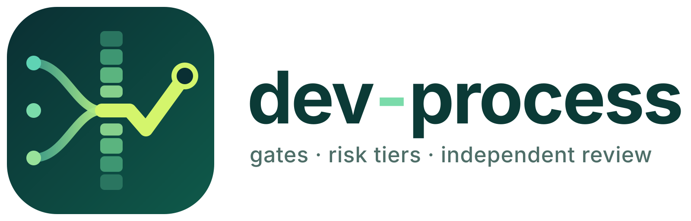

> **English:** [README.md](README.md)

<p align="center">
  <picture>
    <source media="(prefers-color-scheme: dark)" srcset="docs/assets/logo-dark.svg">
    
  </picture>
</p>

# dev-process

Ein Entwicklungsprozess für KI-Agenten, ausgeliefert als
[copier](https://copier.readthedocs.io)-Template für neue und bestehende
Repositories. Er ändert nicht die Agenten, sondern ihre Arbeitsbedingungen:
Regeln prüft ein Programm, der Aufwand folgt dem Risiko, niemand nimmt die
eigene Arbeit ab, und das Gedächtnis liegt in Dateien statt im Kontext.

> **Status:** `v2.27.1` — Sub-Projekte SP1–SP75. Historie: [`CHANGELOG.md`](CHANGELOG.md).

## Einstieg

| Wofür | Dokument |
|---|---|
| Was der Prozess ist, warum er so ist, was offen ist | **[Überblick](docs/UEBERBLICK.md)** · [Overview (English)](docs/OVERVIEW.md) · [PDF](docs/Entwicklungsprozess-mit-KI-Agenten.pdf) |
| Einrichten, headless oder im Dialog, und aktualisieren | [`BOOTSTRAP.md`](BOOTSTRAP.md) |
| Was auf dem Rechner und in CI gebraucht wird | [`docs/SYSTEM-REQUIREMENTS.md`](docs/SYSTEM-REQUIREMENTS.md) |
| Abhängigkeiten dieses Repositorys (erzeugt, auch als CycloneDX) | [`docs/SBOM.md`](docs/SBOM.md) · [`docs/sbom.cdx.json`](docs/sbom.cdx.json) |
| Warum dieser Standard-Stack (Spec-Kit-Vergleich und Entwurf) | [`docs/analysis/`](docs/analysis/) |

## Das Wichtigste

- **Gates statt Erinnerung.** Vor jedem Merge laufen 15 automatische
  Prüfungen. Was nicht besteht, wird nicht gemergt. Der Umfang ist auf das
  reduziert, was im Referenzprojekt nachweislich trägt.
- **Risiko bestimmt den Aufwand.** Tier 0 bis 3 legen fest, ob eine Änderung
  direkt gemergt wird oder Plan, unabhängige Prüfung und bei Tier 3 eine
  Widerlegungsprüfung braucht. Maßgeblich ist der Umfang, nicht die
  Diff-Größe.
- **Unabhängige Prüfung.** Wer baut, nimmt nicht ab. Das Urteil steht als
  Attest im Journal und gilt nur für genau den geprüften Code.
- **Gedächtnis in Dateien.** Regelkern, Pläne mit Entscheidungen und Journal
  liegen im Repository und werden nach jeder Kürzung des Kontexts wieder
  eingespielt.
- **Spezifikation mit [Spec Kit](https://github.com/github/spec-kit).** Ab
  Tier 2 führt der Weg über Spec Kit, gepinnt und mit eigenen Overrides.
- **Parallele Agenten, optional.** Ein Steward teilt Issues zu, startet je
  Phase eine Agentensitzung mit dem Modell aus der Modellpolitik, legt dem
  Owner Fragen als Auswahl vor und merget fertige Branches gebündelt.
- **Drei Harnesses.** Claude Code, GitHub Copilot oder eine neutrale
  `AGENTS.md`; Methodik und Gates sind in allen dieselben.

## Installation

Greenfield und Brownfield, derselbe Befehl im Zielrepo:

```bash
uvx copier copy gh:Crashman1983/dev-process .
```

copier fragt vier Dinge: Projektname, Harness (`claude` | `copilot` |
`agents_md`), CI (GitHub Actions, Standard an) und optional das GitHub-Repo
für den Issue-Check. Bestehende Dateien werden
nicht überschrieben. Danach muss

```bash
uv run scripts/process/gate_runner.py
```

grün sein. Ohne GitHub-CI ist das `git-hooks`-Modul die
einzige Enforcement-Säule; dann erzwingt remote nichts die Gates.

**Ein KI-Agent richtet es ein:** Im Zielrepo genügt *„richte den
Entwicklungsprozess aus Crashman1983/dev-process ein, folge dessen
`BOOTSTRAP.md`“*. Dort stehen das Headless-Rezept und die Pflichtprüfung.

**Aktualisieren:** `uv run scripts/process/template_update.py` im Zielrepo.
Das Skript übernimmt alle gespeicherten Antworten und lässt Dateien, die das
Projekt in `.process-owned` als eigene führt, unberührt. Mit reinem copier
geht es als `uvx copier update --defaults --data 'modules={…}'` mit dem
vollständigen Modul-Dictionary (Rezept in [`BOOTSTRAP.md`](BOOTSTRAP.md)).
Die Antwortdatei `.copier-answers.yml` nicht von Hand editieren.

**Wann es sich nicht lohnt:** Für Wegwerf-Prototypen, Einmal-Skripte und
Arbeit in einer einzigen Sitzung ist der Aufwand größer als der Nutzen.

## Herkunft

Der Prozess ist in vielen Iterationen in einem privaten, produktiv genutzten
Repository entstanden (in den Dokumenten „Referenzprojekt“). Die Geschichte
dieser Entwicklung steht im [`CHANGELOG.md`](CHANGELOG.md) und im Git-Log;
alles, was das Template ausliefert, ist von diesem Projekt unabhängig und
neutral.

## Lizenz

[Apache-2.0](LICENSE): Nutzung, Änderung und Weitergabe sind frei, auch
kommerziell. Jedes eingerichtete Repository erhält den Lizenztext als
`docs/process/LICENSE` und dazu `docs/process/NOTICE.md`: Die Lizenz gilt für
die Prozessdateien, nicht für den eigenen Code und Inhalt des Projekts. Zwei
Spezifikations-Templates sind von GitHub Spec Kit abgeleitet (MIT, © GitHub,
Inc.); Details und der MIT-Text stehen in
[`THIRD-PARTY-NOTICES.md`](THIRD-PARTY-NOTICES.md), die auch jedes
eingerichtete Repository erhält. Die Abhängigkeiten dieses Repositorys listet
die erzeugte [SBOM](docs/SBOM.md) ([CycloneDX](docs/sbom.cdx.json)).
