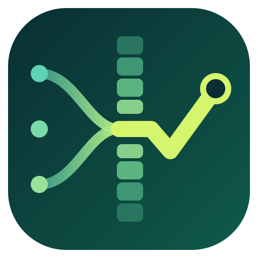

# Entwicklungsprozess mit KI-Agenten

*Wie Ziele, Architektur und Qualität dauerhaft gesichert werden – und welche Rolle der Mensch spielt*

Prinzipien, Mechanik und der Weg in die Fläche

Prozessvorlage dev-process v2.27.0 · erprobt in einem realen, produktiv genutzten Repository (Referenzprojekt)

Vorlage öffentlich auf GitHub: [github.com/Crashman1983/dev-process](https://github.com/Crashman1983/dev-process)

Der Prozess ist in vielen Iterationen im laufenden Betrieb entstanden und verbessert worden; in der Fläche muss er sich noch beweisen. Ein möglicher nächster Schritt ist ein Pilot, etwa auf GitHub mit Copilot. Dieses Dokument beschreibt, was heute umgesetzt ist, unterscheidet zwischen hart geprüften und weich gehaltenen Regeln, zeigt, wie sich die Bausteine auf eine solche Plattform übertragen ließen, und sammelt offene Fragen am Ende. Betriebsdetails des Referenzprojekts sind Beispiele, keine Vorgaben.

> Inhaltsgleich als PDF: [Entwicklungsprozess-mit-KI-Agenten.pdf](Entwicklungsprozess-mit-KI-Agenten.pdf).
> Einrichten: [`BOOTSTRAP.md`](../BOOTSTRAP.md) · Systemumgebung: [`SYSTEM-REQUIREMENTS.md`](SYSTEM-REQUIREMENTS.md).

---

## 1. Die Herausforderung und die Antwort

> KI-Agenten können guten Code schreiben, arbeiten aber unter schlechten Bedingungen: ohne Gedächtnis, ohne Nachweis, ohne unabhängige Abnahme. Der Prozess ändert die Bedingungen, nicht die Agenten.

| Schwäche des Agenten | Was ohne Prozess passiert | Antwort des Prozesses |
|---|---|---|
| Kein Langzeitgedächtnis: Nach einer Pause oder einer automatischen Kürzung des Gesprächs sind Regeln und Absprachen weg. | Der Agent verletzt Vereinbarungen von vor einer Stunde und trifft bereits gefallene Entscheidungen erneut, womöglich anders. | Die wichtigsten Regeln stehen in der Startdatei, die jeder Agent zu Beginn liest, Entscheidungen als Liste im Plan. Nach jeder Kürzung spielt ein Programm beides automatisch wieder ein. |
| Behaupten statt prüfen: Aussagen über vorhandenen Code kommen aus dem Gedächtnis. | Der Agent baut auf einer Funktion auf, die es gar nicht gibt – oder übersieht eine vorhandene und schreibt sie ein zweites Mal. Die Folge sind doppelter Code und Verweise ins Leere. | Regel 1: Jede Aussage braucht einen Nachweis oder wird als Annahme markiert. Für die Dokumentation prüft zusätzlich ein Gate (eine automatische Prüfung vor dem Merge), dass sie nur auf existierende Dateien verweist. |
| Symptome flicken: Ein Fehler wird dort behoben, wo er sichtbar wird. | Die Ursache bleibt; ihr Symptom wird an fünf Stellen einzeln geflickt, die Fehlerrate steigt. | Regel 6: Nach höchstens zwei Versuchen am Symptom wird nach der Ursache gesucht. Ein Gate meldet den dritten Fix an derselben Datei, und die Kennzahlen zeigen, wo dieselbe Stelle immer wieder korrigiert wird. |
| Selbstabnahme: Der Agent, der gebaut hat, beurteilt auch, ob es gut ist. | Die Prüfung wird zur Formsache; Mängel fallen erst im Betrieb auf. | Unabhängige Prüfung durch eine unbeteiligte Instanz; das Ergebnis wird als Attest (schriftlicher Prüfvermerk im Journal, dem fortlaufenden Arbeitsprotokoll im Repository) festgehalten und vom Gate verlangt. |
| Parallelität ohne Absprache: Mehrere Agenten ändern dieselben Dateien. | Die letzte Änderung überschreibt die vorherige; Arbeit geht verloren. | Eine Übersicht aller laufenden Vorgänge (Lagetabelle) zeigt Überschneidungen; zwei Vorhaben am selben Problem werden abgestimmt statt parallel bearbeitet. |

### Das Wesentliche in fünf Sätzen

1. **Die Regeln prüft ein Programm, niemand muss sie im Kopf behalten.** Fünfzehn automatische Prüfungen („Gates“) laufen vor jedem Merge; was nicht besteht, wird nicht gemergt.
1. **Das Risiko bestimmt den Aufwand.** Vier Risikostufen – Tier 0 bis 3 – legen fest, ob eine Änderung direkt gemergt werden darf oder Plan, unabhängige Prüfung und bei Tier 3 zusätzlich eine Widerlegungsprüfung (gezielte Fehlersuche) braucht.
1. **Die Prüfung ist immer unabhängig.** Wer baut, nimmt nicht selbst ab; ab Tier 2 prüft eine unbeteiligte Instanz (eine eigene Agentensitzung), und ihr Urteil gilt nur für genau den geprüften Code.
1. **Alles Wissen steht in Dateien.** Pläne, Entscheidungen und Journale liegen im Repository und werden jedem Agenten automatisch erneut vorgelegt, sobald sein Gedächtnis gekürzt wurde.
1. **Der Mensch entscheidet, die Agenten arbeiten.** Ein Koordinator-Agent verteilt die Arbeit an Arbeiter-Agenten; der Mensch priorisiert, entscheidet, gibt Designs frei und prüft wöchentlich eine Stichprobe.

## 2. Wie der Prozess aufgebaut ist

> Fünf Ebenen, jede mit einer klaren Zuständigkeit. Menschen urteilen, Agenten arbeiten, Programme prüfen, Dateien bewahren das Wissen.

| Ebene | Was dort geschieht |
|---|---|
| **Mensch (Owner)** | priorisiert, entscheidet, gibt Designs frei, prüft wöchentlich eine Stichprobe, schreibt die Regeln fort |
| **Koordinator** | verschafft sich den Überblick, weist Vorgänge zu, startet und stoppt Arbeiter, leitet Fragen an den Menschen weiter, stößt den Merge an – schreibt und prüft selbst keinen Code |
| **Arbeiter und Prüfer** | je Vorgang und Phase eine eigene Sitzung auf eigenem Branch; der Prüfer ist immer eine andere Instanz als der Arbeiter |
| **Gates** | fünfzehn Prüfprogramme vor jedem Merge: Regeln intakt, Entscheidungen getroffen, Attest vorhanden und zum Code passend, Designverträge und Akzeptanzkriterien einheitlich, Lizenzen erlaubt, Dokumentation gültig |
| **Repository** | Regelkern, Pläne mit Entscheidungslisten, Journal mit Attesten, Lagetabelle, Verträge, Kennzahlen – die einzige Quelle, aus der jede Ebene liest |

Der Prozess wird als Vorlage (dev-process) ausgeliefert. Aus ihr entsteht ein fertig eingerichtetes Repository: Startdatei und Phasenbefehle für die gewählte Harness (GitHub Copilot, Claude Code oder eine neutrale AGENTS.md), die Gates sowie GitHub Actions-Workflows für Gates, Owner-Digest, Kennzahlen und Aufräumen. Spätere Versionen der Vorlage holt sich ein Repository mit einem Befehl; projekteigene Dateien bleiben unberührt.

## 3. Regeln und Risikostufen

> Neun Regeln gelten immer; wie viel Verfahren eine Änderung braucht, entscheidet ihr Risiko, nicht ihre Größe.

**Die neun Regeln** stehen in jeder Startdatei und werden von einem Gate zeichengenau gegen das Original geprüft:

| # | Regel | # | Regel |
|---|---|---|---|
| 1 | Nachweis vor Behauptung – jede Aussage über Code wird belegt oder als Annahme markiert | 6 | Ursache vor Symptom – nach höchstens zwei Versuchen am Symptom wird die Ursache gesucht |
| 2 | Plan vor Arbeit – ab Tier 2 ein schriftlicher Plan, bevor Code entsteht | 7 | Review vor Merge – so unabhängig, wie das Risiko verlangt |
| 3 | Vertrag zuerst – Schnittstellen und Oberflächen werden vor dem Code verbindlich beschrieben | 8 | Kleine, klar benannte Änderungen – Ausnahmen werden im Commit genannt |
| 4 | Ein zuständiger Baustein je Verhalten – keine Kopien; schwer umkehrbare Entscheidungen werden dokumentiert, bevor Code auf ihnen aufbaut | 9 | Lesbarer Code – geschrieben für den nächsten Leser |
| 5 | Tests belegen die Abnahme – jedes Kriterium hat einen Test |  |  |

**Die vier Tiers.** Maßgeblich ist das Risiko, nicht der Umfang: Eine Zehn-Zeilen-Änderung, von der andere Komponenten abhängen, ist Tier 2, eine Formatierung Tier 0. Das eingestufte Tier darf nur nach oben korrigiert werden. Es steigt auf mindestens Tier 2, sobald eine dieser Fragen mit Ja beantwortet wird: Werden Daten dauerhaft gespeichert? Verlässt eine Benutzereingabe den Prozess? Geht es um Zugriffsschutz? Hängt anderer Code von der Schnittstelle ab? Ist mehr als eine Oberfläche betroffen? Ist Datenverlust möglich? Wird dieselbe Stelle wiederholt geändert? Tier 3 gilt, wenn die Änderung Zugriffsschutz, Datenhaltung und Migrationen, eine Sicherheitsgrenze oder einen Vertrag über mehrere Repositories berührt.

| Tier 0 | Tier 1 | Tier 2 | Tier 3 |
|---|---|---|---|
| Keine Verhaltensänderung, oder lokal und umkehrbar | Kleine, in sich geschlossene Änderung | Etwas, wovon andere abhängen: Schnittstelle, Schema | Zugriffsschutz, Datenhaltung, Sicherheitsgrenze |
| direkt mergen | Kurzverfahren (Ziel, Dateien und Risiko in einem Satz, kein schriftlicher Plan) plus ein Test | Plan, Umsetzung, unabhängige Prüfung | zusätzlich: freigegebenes Design, Bedrohungsfrage, Widerlegungsprüfung, zweites Modell (wo verfügbar) |

**Widerlegungsprüfung** heißt: Bei Tier 3 prüft zusätzlich eine Instanz, deren einziger Auftrag es ist, Fehler zu finden. **Zweites Modell** heißt: ein Modell eines anderen Herstellers, wo eines verfügbar ist; ist keines verfügbar, sagt das Attest das ausdrücklich. Das Gate verlangt das zweite Modell nicht, aber es verlangt, dass sein Fehlen offen angegeben wird.

## 4. Prüfung, Gedächtnis, Ziele und Messung

> Ein Prüfurteil zählt nur, wenn es unabhängig entstanden und an genau den geprüften Code gebunden ist. Was Agenten wissen müssen – Entscheidungen, Ziele, Kennzahlen – steht in Dateien und wird ihnen nach jeder Kürzung erneut vorgelegt.

**Prüfung.** Ab Tier 2 erhält eine unbeteiligte Instanz ein schreibgeschütztes Bundle – Änderungen, Plan, Tests, Bilder – und nicht das Gespräch, in dem die Arbeit entstand. Ihr Attest im Journal nennt Vorgang, Tier, Prüfer, Modell, Unabhängigkeitsmerkmale, Verdikt, Runde und die Prüfsummen des Codes. Das Gate prüft, ob ein Attest vorliegt, ob seine Merkmale zum Tier passen und ob es zum gemergten Code gehört. Was es nicht prüfen kann: ob der Prüfer wirklich eine andere Instanz war. Das beruht auf der Angabe des Prüfers – deshalb die wöchentliche Stichprobe durch den Menschen.

**Gedächtnis.** Plan mit Entscheidungsliste, Journal und Aufgabenliste liegen im Repository. Ein Kommando liefert daraus, was in Arbeit ist, was als Nächstes kommt, welche Entscheidungen gelten und welche Frage offen ist. Nach jeder Kürzung einer Sitzung spielt ein Programm die neun Regeln im Wortlaut und die letzten zwölf Entscheidungen automatisch neu ein. Der Anlass war eine Beobachtung aus dem Betrieb: Die bloße Anweisung, nach einer Kürzung die Regeln neu zu lesen, wurde selbst mit weggekürzt.

**Ziele.** Ein Vorgang startet erst, wenn sein Typ feststeht und seine Akzeptanzkriterien als prüfbare Sätze vorliegen („Wenn <Auslöser>, dann soll das System <Reaktion>“, inklusive Negativ-, Rand- und Berechtigungsfällen). Abgenommen wird erst, wenn jedes Kriterium einen bestandenen Test hat, alle Gates grün sind und die Dokumentation nachgezogen ist. Beide Bedingungen stehen als Listen im Repository (Start- und Abnahmeliste) und werden fortgeschrieben: Sagt ein Mensch „am Ende muss X gelten“, wird X aufgenommen.

**Messung.** Ein Cockpit (Auswertungsskript im Repository) liest Journal, Git-Historie und Meldungen; jede Zahl nennt ihre Aussagekraft. Vier Kennzahlen sind maßgeblich:

- **Prüfrunden bis zur Freigabe.** Ziel: höchstens zwei bei 90 % der Vorgänge. Wird in Runde 3 noch abgelehnt, wird eine Regel festgehalten oder der Vorgang geteilt.
- **Korrekturquote.** Anteil der Features, die binnen sieben Tagen korrigiert werden mussten; nur der Trend zählt.
- **Korrektur-Häufungen.** Stellen, die immer wieder korrigiert werden – Regel 6 in Zahlen.
- **Prüfrunden je Modell.** Zeigt, welches Modell sich in welcher Phase bewährt.

## 5. Architekturvorgaben: hart und weich

> Vorgaben halten nicht, weil jemand sie kennt, sondern weil ein Gate sie prüft („hart“). Wo nur ein Prüfer urteilt („weich“), ist das in der Tabelle ausdrücklich ausgewiesen.

| Vorgabe | Mechanismus | Hart / weich | Referenzprojekt |
|---|---|---|---|
| Entscheidungen vor dem Code | Schwer umkehrbare Entscheidungen werden dokumentiert, bevor Code auf ihnen aufbaut; ein Gate prüft, ob verlangte Entscheidungen getroffen sind. Regeln, die überall gelten müssen, bekommen einen zuständigen Baustein und einen Test mit allen bekannten Fällen. | hart: verlangte Entscheidungen sind getroffen; weich: ob überhaupt eine nötig ist | 73 Entscheidungsdokumente |
| Schnittstellen zuerst | Eine Schnittstelle wird beschrieben, bevor jemand sie nutzt (Regel 3). Ob die Beschreibung existiert und der Code sie einhält, prüfen Tests und Prüfer. | weich: Review und Tests | aktiv |
| Oberflächen nach Vertrag | Ein Design-Vertrag benennt Abstände, Farben und Zustände mit IDs; Referenzbilder sind per Prüfsumme versiegelt. Ein Gate prüft IDs und Siegel, der Prüfer vergleicht das Ergebnis mit dem Bild. | hart: IDs und Siegel; weich: Aussehen | aktiv |
| Schichten, Abhängigkeits­richtung | Die Architekturbeschreibung legt fest, welche Schicht welche andere nicht verwenden darf. Maschinell geprüft wird das nur mit einem Arch-Linter. | hart nur mit Linter | Linter nicht eingerichtet |
| Sicherheit | Tier 3 verlangt Bedrohungsfrage, Widerlegungsprüfung und – wo verfügbar – ein zweites Modell. Dazu kommt eine SBOM (Liste aller Fremdkomponenten), deren Lizenzen ein Gate gegen eine erlaubte Liste prüft. | hart: Tier-3-Ablauf, SBOM-Lizenzen | aktiv; die Lizenzliste legt jedes Projekt an |
| Performance | Die Review-Checkliste fragt nach Performance. Was nicht gemessen wird, lässt keine Prüfung scheitern. | weich | keine Zielwerte festgelegt |
| Wartbarkeit, Dokumentation | Wartbarkeit beurteilt der Prüfer nach den Regeln 4, 6 und 9; die Kennzahlen zeigen wiederholte Korrekturen. Für die Dokumentation prüfen Gates, ob genannte Dateien und Verweise existieren. | weich; hart für Verweise | aktiv |
| Legacy | Bestehende Verstöße werden in einer Baseline festgehalten und geduldet, neue nicht. Die Baseline darf nur kleiner werden. | hart, sobald eine Baseline existiert | Verfahren in der Vorlage |

**Lebenszyklus einer Vorgabe:** Eine neue Vorgabe beginnt mit einem Entscheidungsdokument. Was sich maschinell prüfen lässt, wird zur verbotenen Abhängigkeit im Architektur-Linter oder zu einem Test mit allen bekannten Fällen; der Rest wird Frage in der Review-Checkliste. Bestehende Verstöße kommen in eine Baseline, die nur kleiner werden darf. Ein neuer Verstoß lässt das Gate scheitern; eine Ausnahme gibt es nur als Entscheidungsdokument mit Ablaufdatum. Neue nichtfunktionale Ziele nehmen denselben Weg und bekommen zusätzlich einen Punkt in der Abnahmeliste.

## 6. Die Rolle des Menschen

> Der Mensch schreibt keinen Code und liest nicht jede Änderung. Was ihm bleibt, ist das Urteil – an fünf Stellen, die kein Agent übernehmen darf.

**Fünf Aufgaben des Owners**

- **Priorisieren.** Er legt fest, was als Nächstes freigegeben wird. Legt ein Agent Dutzende Vorgänge an, beginnt die Arbeit erst, wenn der Owner sie sortiert hat.
- **Entscheiden.** Jede Produkt-, Architektur- oder Risikofrage kommt als Auswahl mit Optionen und Empfehlung; die Antwort wird zur Entscheidungszeile im Plan.
- **Designs freigeben.** Bei Tier 3 wird nicht gebaut, bevor das Design freigegeben ist. Der Merge selbst braucht seine Zustimmung nicht; dafür sorgen Gates und Attest.
- **Stichprobe prüfen.** Einmal pro Woche einen bereits gemergten Vorgang gründlich lesen; welcher es ist, bestimmt die Kalenderwoche. Kein Agent weiß vorher, welcher gezogen wird.
- **Regeln fortschreiben.** Start- und Abnahmeliste werden laufend ergänzt: Eine Vorgabe des Owners wird dauerhaft Teil des Prozesses, nicht nur Einzelfall.

Der Owner arbeitet über die Oberfläche seiner Harness: auf GitHub etwa über Issues, Pull Requests und den Owner-Digest, den ein Workflow erzeugt; im Referenzprojekt über eine Chat-App, auch mobil. Was er nicht mehr tut: an Regeln erinnern, Fortschritt erfragen, mergen, Sitzungen starten (im Referenzprojekt; auf GitHub offen), aufräumen.

## 7. Ein Vorgang von Anfang bis Ende

> Jede Phase läuft in einer eigenen Sitzung mit dem Modell, das die Modellpolitik (eine Konfigurationsdatei) für Tier und Phase festlegt. Die Phasen folgen ohne Wartezeit aufeinander; gewartet wird nur auf Entscheidungen des Menschen.

| Ready | Plan | Umsetzung | Review | Merge | Deploy |
|---|---|---|---|---|---|
| Owner gibt frei | Plan + Entscheidungen | Test zuerst, je Aufgabe ein Commit | unbeteiligte Instanz, Attest | Merge Queue: Gates und Tests einmal | ein Deploy je Queue-Lauf |

**Fragen.** Kann nur der Owner entscheiden, trägt der Arbeiter die Frage mit Optionen und Empfehlung in den Plan ein und meldet „blockiert“. Der Koordinator legt sie dem Owner als Auswahl vor, die Antwort wird als Entscheidung im Plan vermerkt, und der Arbeiter macht weiter.

**Merge.** Freigegebene Branches werden in einer Merge Queue gesammelt, einmal gemeinsam durch Gates und Testsuite geführt und der Reihe nach gemergt. Scheitert der gemeinsame Lauf, wird der verursachende Branch ermittelt, aus der Queue genommen und an seinen Arbeiter zurückgemeldet.

**Ausfall des Koordinators.** Nichts geht verloren: Der Zustand liegt in Git; Arbeiter halten an, wenn sie eine Entscheidung brauchen; ein neuer Koordinator hat den Stand in einer Minute eingelesen.

**Beispiel aus dem Referenzprojekt:** ein Vorgang in Tier 2 – Plan um 21:18, zwei Fragen an den Owner während der Umsetzung, Review in drei Runden (Runde 1 Block), Merge um 04:24. Sieben Stunden, zwei menschliche Entscheidungen, kein weiterer manueller Schritt.

## 8. Eine Möglichkeit: GitHub mit Copilot

> Regeln, Gates, Journal und Kennzahlen sind Dateien und Skripte auf Git-Basis. Deshalb lässt sich der Prozess auf eine Plattform wie GitHub übertragen: Sie könnte die Gates ausführen, die Vorgänge als Issues führen und Merges in der Merge Queue sammeln; Copilot würde die Regeln lesen wie jede andere Harness.

Die folgende Tabelle zeigt, wie sich die Bausteine abbilden ließen und was davon heute schon in der Vorlage steckt. Sie ist ein Weg, keine Festlegung.

| Baustein | Mögliches GitHub-Mittel | Stand |
|---|---|---|
| Startdatei, Regelkern | „copilot-instructions.md“ mit dem geprüften Regelblock; Pfadregeln unter „.github/instructions“. | in der Vorlage |
| Phasenbefehle | Prompt-Dateien unter „.github/prompts“ für Brainstorm, Plan, Umsetzung, Prüfung, Kurzverfahren, Debug, Commit, Wiederherstellung. | in der Vorlage |
| Gates | Actions-Workflow bei jedem Pull Request, als Required Status Check in der Branch Protection hinterlegt; ein Skript setzt ihn, ohne bestehende Regeln zu überschreiben. | in der Vorlage |
| Vorgänge | Issues mit Typ und Akzeptanzkriterien; ein Gate prüft, dass Pläne ihr Issue nennen und Tier-3-Arbeit nicht ohne Issue beginnt. | in der Vorlage |
| Arbeiter | Denkbar ist eine Copilot-Sitzung je Issue auf eigenem Branch – im Editor oder als Copilot Coding Agent, der einen Pull Request öffnet. | vorgesehen, nicht erprobt |
| Prüfung | Unbeteiligter Prüfer mit Review-Prompt und Bundle, Attest im Journal; Copilot Code Review als zusätzliche Stimme. Da Copilot Modelle mehrerer Hersteller anbietet, wäre das zweite Modell nur ein Konfigurationseintrag. | Prompt und Gate in der Vorlage |
| Merge Queue | Die Merge Queue könnte freigegebene Pull Requests sammeln, gemeinsam prüfen und der Reihe nach mergen. | GitHub-Funktion; nicht erprobt (Referenzprojekt: eigener Merge Train) |
| Überblick und Aufräumen | Owner-Digest, Kennzahlen und das Aufräumen erledigter Branches laufen als Actions-Workflows. | in der Vorlage |
| Koordinator | Übersicht und Statusmeldungen lassen sich als Actions ausführen. Offen ist, wer auf GitHub die Sitzungen startet und stoppt. | offen (Kapitel 11) |

**Was sich dadurch ändern würde:** Im Referenzprojekt laufen die Gates auf einem einzelnen Server, auf GitHub liefen sie in der Organisation; mit Branch Protection könnte nur noch ein Administrator die Gates umgehen; und für das zweite Modell bei Tier 3 müsste niemand mehr die Harness wechseln. Ob das in der Praxis trägt, soll ein Pilot zeigen.

## 9. Skalierung auf eine Organisation

> Die Einheit des Prozesses ist das Repository. Maschinen skalieren mit; die Grenze ist die Zahl der Entscheidungen, die ein Owner treffen kann.

**Was mitwächst:** Jedes Repository erhält die Vorlage mit seinen eigenen Gates, seiner Modellpolitik und seiner Lagetabelle. Die Vorlage wird zentral versioniert und enthält organisationsweite Regeln wie Schichtenregeln oder die erlaubten Lizenzen; ein Update kommt als Pull Request in jedes Repository. Gates laufen zentral, etwa in GitHub Actions, und wachsen mit der Organisation. Arbeiter sind Sitzungen der Harness, zum Beispiel eine je Issue, und die Modellpolitik legt neben den Modellen auch fest, wie viele davon gleichzeitig laufen.

**Was nicht von selbst mitwächst:** Jedes Repository braucht einen Owner, und jeder Vorgang braucht im Mittel ein bis zwei seiner Entscheidungen. Wie viele parallele Vorgänge ein Owner trägt, ist die eigentliche Kapazitätsgrenze – und heute nicht gemessen. Ebenso offen ist, wo der Koordinator in einer größeren Umgebung läuft und ob ein Koordinator mehrere Repositories führen kann.

**Was sich für Entwickler ändert:** Sie übernehmen die Owner-Rolle eines Repositorys, prüfen Stichproben und schreiben Akzeptanzkriterien, Verträge und Entscheidungen. Rollenbild, Qualifizierung und Vertretung sind noch zu beschreiben (Kapitel 11).

## 10. Risiken und Stand

> Ein Prozess, der jede Aussage belegen will, nennt seine Grenzen selbst. Die Zahlen sind eine Baseline, kein Urteil.

| Risiko | Bedeutung | Gegenmaßnahme heute |
|---|---|---|
| Gates umgehbar | Ohne Branch Protection kann ein Merge die Gates überspringen. | Jede Umgehung muss im Commit benannt werden; die Branch Protection macht das Gate zur Pflicht; der Owner zieht Stichproben. |
| Attest ist Selbstauskunft | Ob der Prüfer eine andere Instanz war, kann das Gate nicht nachprüfen. | Prüfsitzungen startet ein Programm, nicht ein Mensch von Hand; das Attest ist an den Code gebunden; der Owner zieht Stichproben. |
| Eine Modellfamilie | Im Referenzprojekt liefen zwei Drittel der Tier-3-Prüfungen ohne zweites Modell; das Gate verlangt dann nur eine ausdrückliche Erklärung. | Die Widerlegungsprüfung bleibt; Plattformen wie Copilot bieten Modelle mehrerer Hersteller; ob das Gate das zweite Modell verlangen soll, ist offen. |
| Modellpolitik ist Code | Die Datei enthält auch den Startbefehl der Sitzungen; wer sie ändert, kann Befehle auf dem startenden Rechner ausführen. | Wird wie die Konfiguration der Prüfumgebung behandelt: Jede Änderung durchläuft die Prüfung. |
| Anbieterbindung | Die Koordinationsschicht (Lagetabelle, Koordinator, Merge Train) ist bisher nur mit Claude Code erprobt. | Die Prozessdateien sind anbieterneutral; die Vorlage bringt Anpassungen für Copilot, Claude Code und AGENTS.md mit. |
| Ein Mensch | Fällt der Owner aus, bleiben Entscheidungen aus. | Alles Wissen liegt in Dateien; eine Vertretung ist noch nicht geregelt. |
| Junge Koordinationsschicht | Lagetabelle, Koordinator und Merge Train (die eigene Merge Queue des Referenzprojekts) sind neu und wurden in kurzer Folge achtmal überarbeitet. | Zwei unabhängige Reviews mit 45 Befunden, alle eingearbeitet; Vorsatz: vor jeder Erweiterung eine Woche Betrieb. |

| Maß (Referenzprojekt) | Wert | Einordnung |
|---|---|---|
| Commits, 14 Tage | 1.505 | davon 537 Dokumentation und Prozess, 316 Korrekturen, 243 Tests, 190 Features, 219 Sonstige |
| Prüfverdikte, ca. 4 Wochen | 611 Pass / 211 Block | Die Prüfung findet Mängel. Die Block-Quote ist gestiegen (jüngere Hälfte des Zeitraums 36 %, davor 24 %). |
| Vorgänge mit mehr als 2 Runden | 82 von 396 (21 %) | Ziel: höchstens 10 %. Ab Runde 3 wird eine Regel festgehalten oder der Vorgang geteilt. |
| Korrekturquote (Features, die binnen 7 Tagen korrigiert wurden) | 44,4 % (20 von 45 Features) | DORA-Band „medium“, nahe an „low“; aussagekräftig ist erst der Verlauf über drei Zeiträume. |
| Korrektur-Häufung | 11 Korrekturen an 5 Stellen | Eine fachliche Regel im Code wurde Stelle für Stelle nachgebessert; sie bekommt jetzt einen zuständigen Baustein und einen Test. |

Der Kern – Gates, Prüfung, Regelkern, Journal, Design-Verträge – ist stabil; was im Referenzprojekt nicht trug, ist gestrichen. Die Koordinationsschicht ist die jüngste. Aus ihren acht schnellen Überarbeitungen folgt ein Vorsatz, noch keine Regel: eine Betriebswoche vor jeder Erweiterung, und Änderungen an der Koordinationsschicht durchlaufen dieselben Tiers wie Produktcode.

## 11. Offene Fragen und Ausblick

> Was heute nicht beantwortet ist, steht hier als Frage mit dem nächsten Schritt.

| Bereich | Frage | Nächster Schritt |
|---|---|---|
| Organisation | Wie viele parallele Vorgänge trägt ein Owner? | Entscheidungen je Vorgang und Wartezeit auf den Owner im Pilot messen; daraus die Zahl der Repositories je Owner ableiten. |
| Organisation | Wo läuft der Koordinator, und führt einer mehrere Repositories? | Im Pilot einen Koordinator je Repository betreiben; danach einen für zwei Repositories erproben. |
| Organisation | Was wird aus den Entwicklern? Wer vertritt den Owner? | Rollenbild und Qualifizierung beschreiben; Vertretungsregel für Fragen, Stichprobe und Modellpolitik festlegen. |
| Organisation | Wie verteilt sich eine Vorlagen-Änderung auf viele Repositories? | Updates automatisch als Pull Request in jedes Repository stellen; ein zweites Repository aus der Vorlage aufsetzen. |
| Architektur | Soll das Gate bei Tier 3 das zweite Modell verlangen? | Regel einführen: Sieht die Modellpolitik ein zweites Modell vor, verlangt das Gate es auch. |
| Architektur | Wird die Abhängigkeitsrichtung maschinell geprüft? Gibt es ein Sicherheitsmindestmaß? Wie wird Performance gesichert? | Arch-Linter einrichten; Sicherheitsregelwerk anlegen; Zielwerte für Performance als Test und als Punkt der Abnahmeliste festlegen. |
| Architektur | Wie werden Ausnahmen und Legacy behandelt? | Jede Ausnahme als Entscheidungsdokument mit Ablaufdatum führen, ein Gate meldet abgelaufene; eine Baseline je Repository anlegen, die nur kleiner werden darf. |
| Prozess | Trägt der Prozess auf einer anderen Plattform, etwa GitHub mit Copilot? | In einem Pilot-Repository Arbeiter je Issue und die Merge Queue erproben und mit dem Referenzprojekt vergleichen. |
| Prozess | Welche Arten von Fehlern entstehen? | Jedes Block-Verdikt erhält ein Schlagwort, damit das Cockpit Fehlerarten zählt, nicht nur Mengen. |

Was dieses Dokument nicht behauptet: dass der Prozess fertig ist. Was es behauptet: dass jede Regel entweder von einem Programm geprüft wird oder ausdrücklich als Urteil ausgewiesen ist, dass jede Zahl ihre Aussagekraft nennt und dass die offenen Fragen bekannt sind. Das ist der Stand, von dem aus ein Pilot starten kann.

Die Prozessvorlage ist öffentlich und kann eingesehen werden: [github.com/Crashman1983/dev-process](https://github.com/Crashman1983/dev-process)
